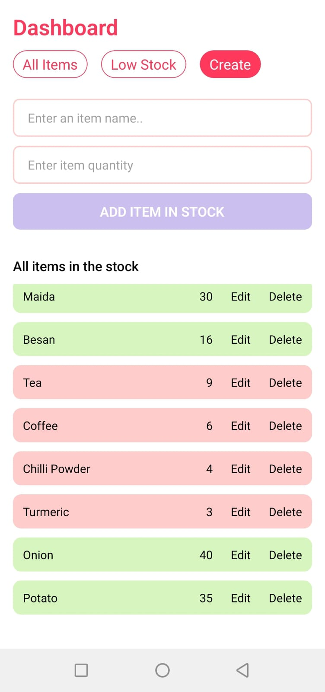
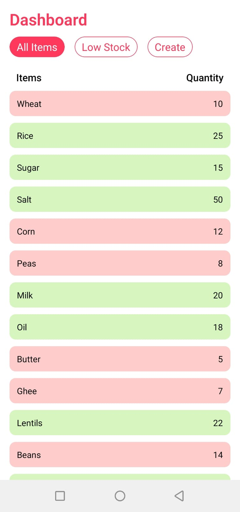
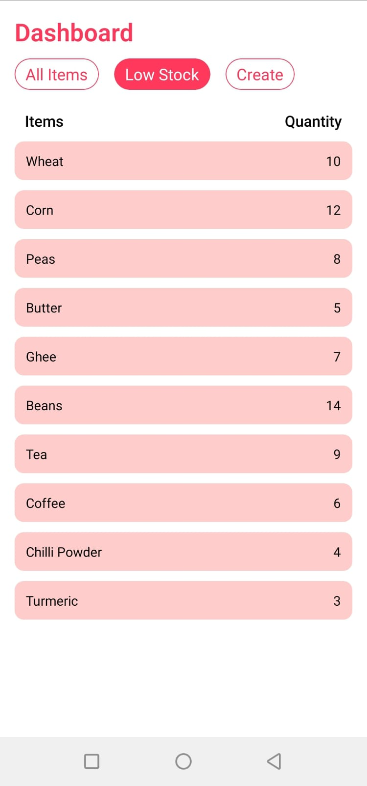

# Stock-Manager App 📦

A simple and useful **React Native inventory management app** that helps you manage grocery or shop stock.  
You can view all items, track low stock, and add or update items easily.

---

## 📁 Project Structure

StockApp/
├── android/
├── ios/
├── src/
│ └── screens/
│ ├── HomeScreen.jsx
│ ├── AllItems.jsx
│ └── CreateScreen.jsx
├── assets/
│ ├── home.png
│ ├── create.png
│ └── lowstock.png
├── App.jsx
├── index.js
├── package.json
└── README.md

---

## ⭐ Features

- View complete stock list with quantities
- Low stock items highlighted automatically
- Add new items with validation
- Update or remove an existing item
- Simple navigation tabs with icons

---

## 📸 Screenshots

| Dashboard / Create Item | All Items View | Low Stock View |
|------------------------|----------------|----------------|
|  |  |  |

## 🧱 Screens Overview

| Screen | Description |
|-------|-------------|
| **Home** | Switch between All Items, Low Stock, and Create Item |
| **All Items** | Shows full stock inventory |
| **Low Stock** | Shows only items below a stock threshold (default 15) |
| **Create Item** | Add or update stock items |

---

## 🚀 How to Run the Project
Install Dependencies
```
npm instal
```
Start Metro Server

````
npm start
````

Run App on Android Device / Emulator

```
npx react-native run-android
````
## 📱 Generate APK (Release Build)
Follow these commands:
```
cd android
./gradlew assembleRelease

`````
Your APK will be created at:
```
android/app/build/outputs/apk/release/app-release.apk
````
Send this APK to any device and install.
Enable "Install Unknown Apps" if required.

## 🧰 Tech Stack

| Technology   | Purpose                                  |
| ------------ | ---------------------------------------- |
| React Native | App user interface and logic             |
| JavaScript   | Functional programming logic             |
| Gradle       | Android build process for APK generation |
| React Hooks (useState) |State Management
| FlatList & Custom Components	|UI Layout |
## 📄 License

This project is free to use and modify. Give credit if you showcase it publicly.

